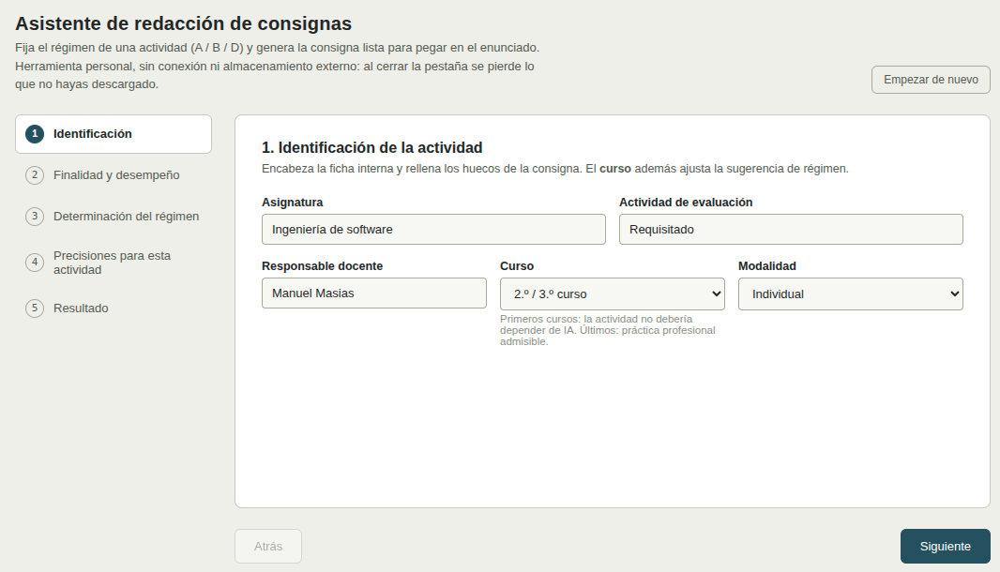
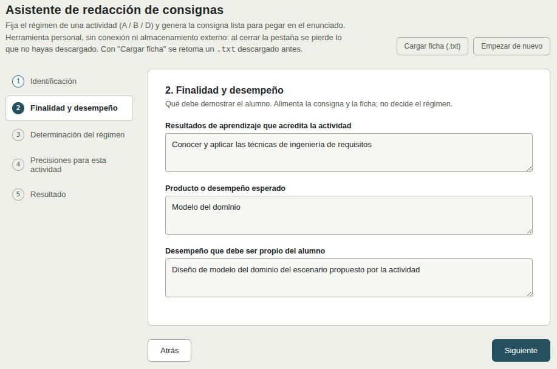
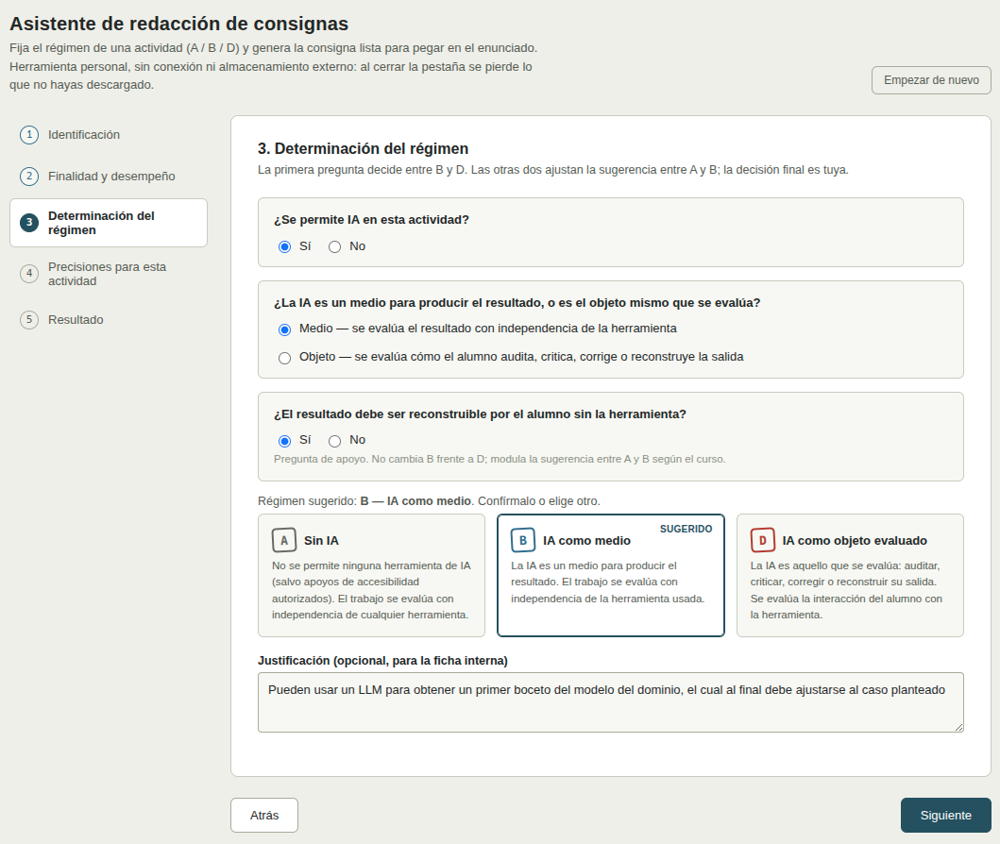
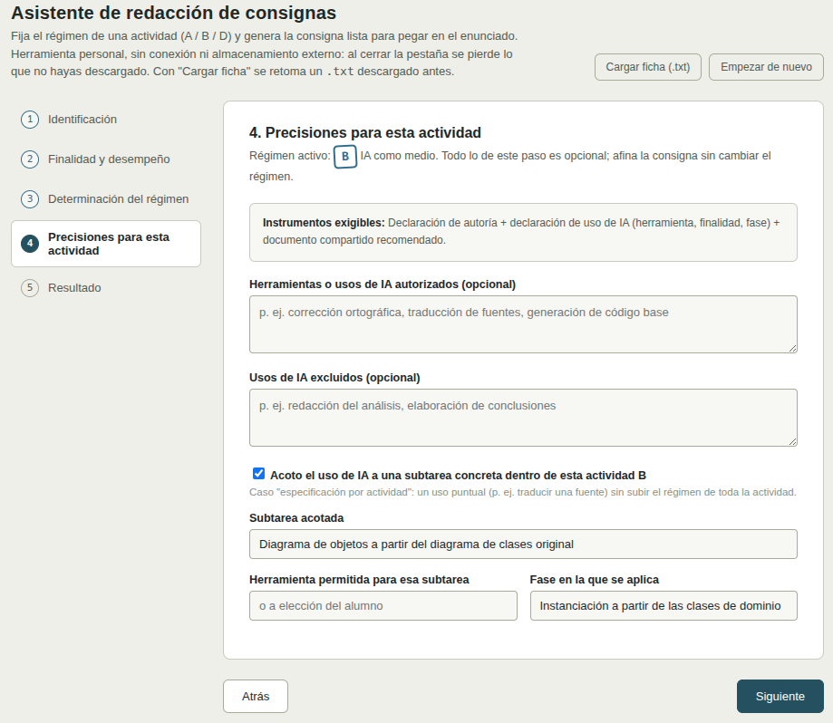
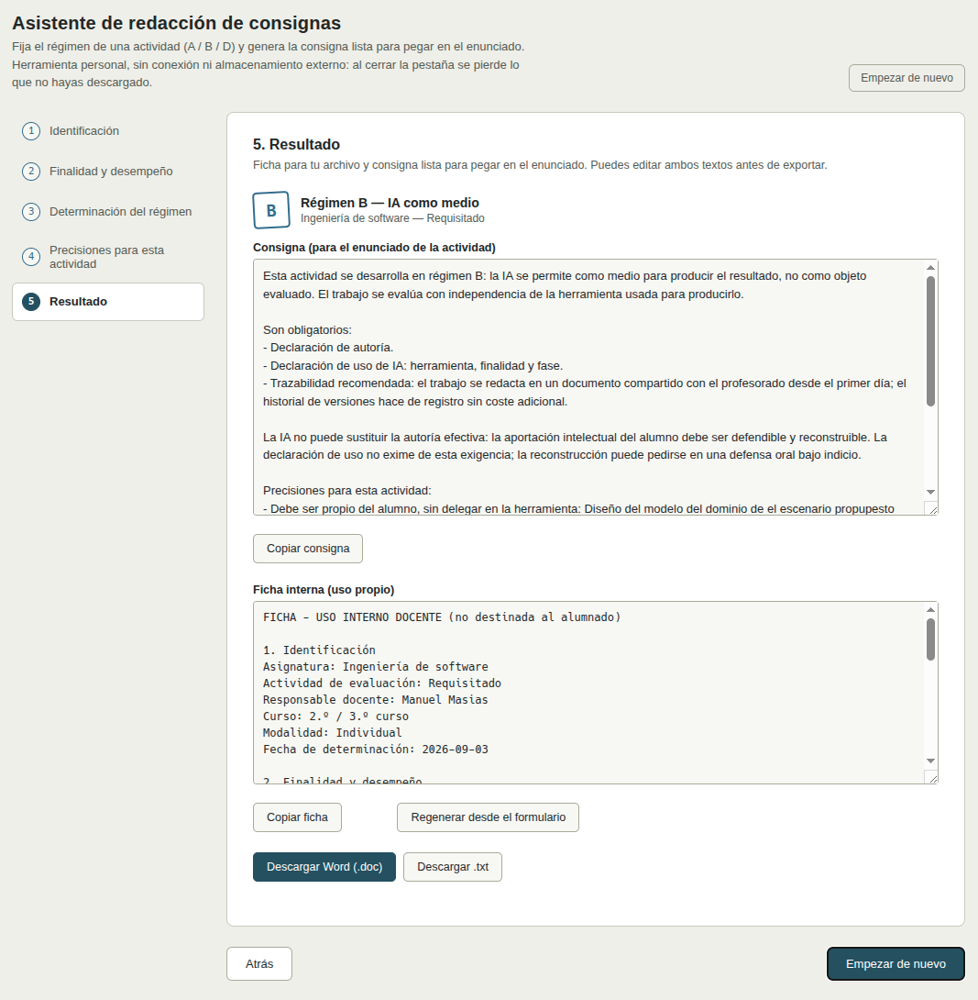

# Asistente de redacción de consignas

Herramienta para fijar el régimen de uso de IA de una actividad (A / B / D) y generar la consigna lista para pegar en el enunciado. Archivo único, sin conexión: se descarga [`asistente-consignas-profesor.html`](asistente-consignas-profesor.html) y se abre en el navegador.

## Cómo funciona, paso a paso

<div align="center">

|
|-
_**1. Identificación.** Asignatura, actividad y curso. El curso ajusta la propuesta de régimen: más restrictivo en primeros cursos, con más margen en los últimos._

|
|-
_**2. Finalidad y desempeño.** Qué acredita la actividad y qué parte del trabajo debe ser del alumno aunque use IA. Este último campo pasa literal a la consigna._

|
|-
_**3. Determinación del régimen.** Tres preguntas fijan el régimen: si se permite IA, si la IA es un medio o el objeto evaluado, y si el resultado debe ser reconstruible sin la herramienta. El asistente propone un régimen; la decisión final es del profesor._

|
|-
_**4. Precisiones (opcional).** Afina la consigna sin cambiar el régimen: usos de IA autorizados o excluidos, y —solo en régimen B— una subtarea acotada en la que se permite IA sin subir el régimen de toda la actividad._

|
|-
_**5. Resultado.** Se generan la consigna (para el enunciado) y la ficha interna (para el archivo del profesor), editables. Descarga en Word o texto, o copia al portapapeles._

</div>

## Qué genera el asistente

Dos textos, ambos editables antes de descargar:

<div align=center>

|La consigna|La ficha interna|
|-|-|
Va en el enunciado de la actividad. Es lo que lee el alumno: el régimen aplicable, qué tiene que declarar, qué usos de IA se permiten y cuáles no.|No se entrega al alumno. Queda en el archivo del profesor y deja constancia de **por qué** se fijó ese régimen —las respuestas dadas al asistente, la justificación pedagógica, los instrumentos exigibles—. Es el documento al que se recurre si más adelante hay una revisión académica o una consulta al comité.

</div>

A continuación, un ejemplo completo (régimen B, con una subtarea acotada).

### La consigna (para el enunciado de la actividad)

```
Esta actividad se desarrolla en régimen B: la IA se permite como medio para producir el resultado, no como objeto evaluado. El trabajo se evalúa con independencia de la herramienta usada para producirlo.

Son obligatorios:
- Declaración de autoría.
- Declaración de uso de IA: herramienta, finalidad y fase.
- Trazabilidad recomendada: el trabajo se redacta en un documento compartido con el profesorado desde el primer día; el historial de versiones hace de registro sin coste adicional.

La IA no puede sustituir la autoría efectiva: la aportación intelectual del alumno debe ser defendible y reconstruible. La declaración de uso no exime de esta exigencia; la reconstrucción puede pedirse en una defensa oral bajo indicio.

Precisiones para esta actividad:
- Debe ser propio del alumno, sin delegar en la herramienta: Diseño del modelo del dominio del escenario propuesto por la actividad

Especificación por actividad. Dentro de esta actividad se autoriza excepcionalmente el uso de IA para:
- Subtarea acotada: Diagrama de objetos a partir del diagrama de clases original
- Herramienta permitida para esa subtarea: LLM
- Fase en la que se aplica: Instanciación a partir de las clases de dominio
El resto de la actividad sigue en régimen B sin IA o con IA solo como medio ya declarado. La excepción no sube el régimen de la actividad entera.
```

### La ficha interna (uso propio)

```
FICHA - USO INTERNO DOCENTE (no destinada al alumnado)

1. Identificación
Asignatura: Ingeniería de software
Actividad de evaluación: Requisitado
Responsable docente: Manuel Masias
Curso: 2.º / 3.º curso
Modalidad: Individual
Fecha de determinación: 2026-09-03

2. Finalidad y desempeño
Resultados de aprendizaje: Conocer y aplicar las técnicas de ingeniería de requisitos
Producto o desempeño esperado: Modelo del dominio
Desempeño que debe ser propio del alumno: Diseño del modelo del dominio de el escenario propupesto por la actividad

3. Determinación del régimen
¿Se permite IA?: Sí
¿La IA es medio u objeto evaluado?: medio
¿El resultado debe ser reconstruible sin la herramienta?: si
Régimen sugerido: B
Régimen fijado: B - IA como medio
Justificación: Pueden usar un LLM para obtener un primer boceto del modelo del dominio, el cual al final debe ajustarse al caso planteado

4. Precisiones
Usos de IA autorizados: -
Usos de IA excluidos: -
Especificación por actividad (subtarea acotada): Diagrama de objetos a partir del diagrama de clases original | herramienta: LLM | fase: Instanciación a partir de las clases de dominio

5. Instrumentos exigibles en el régimen B
Declaración de autoría + declaración de uso de IA (herramienta, finalidad, fase) + documento compartido recomendado.
```