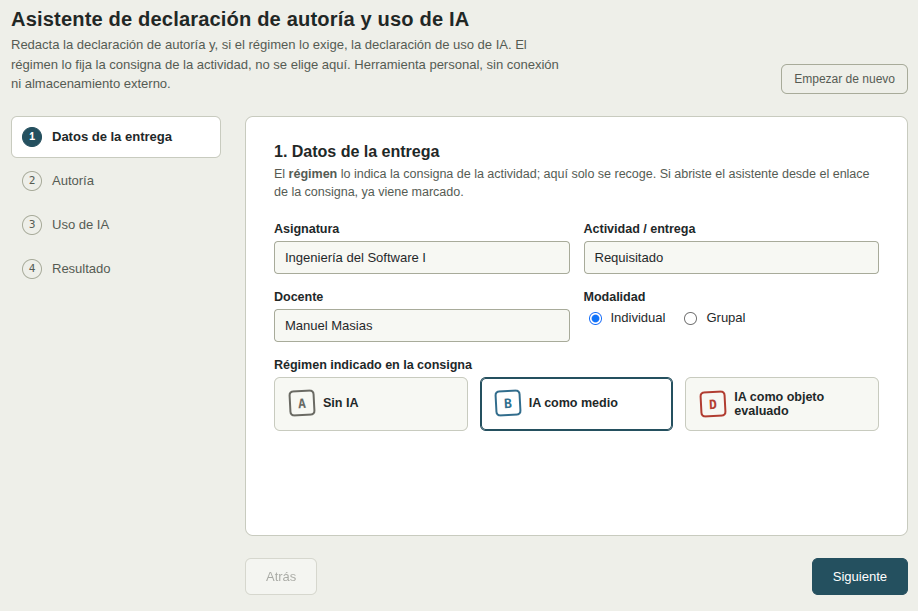
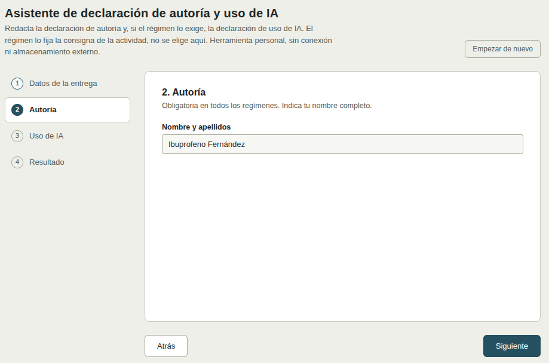
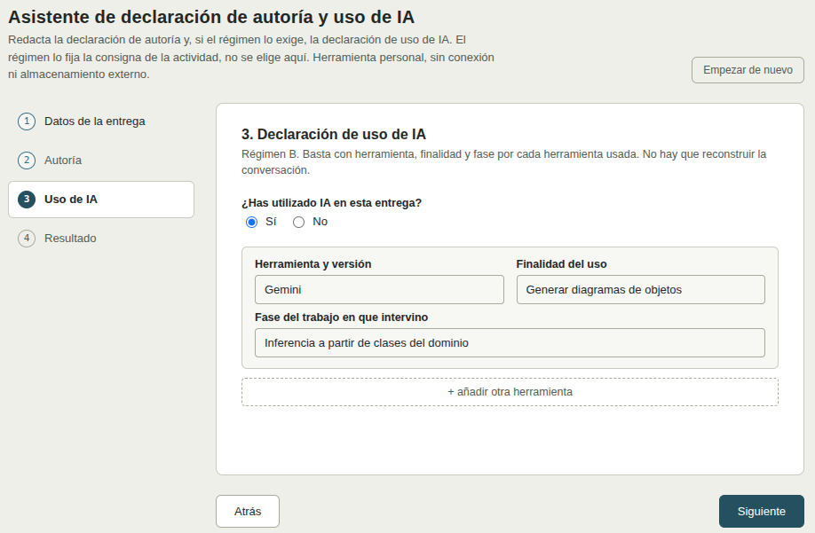
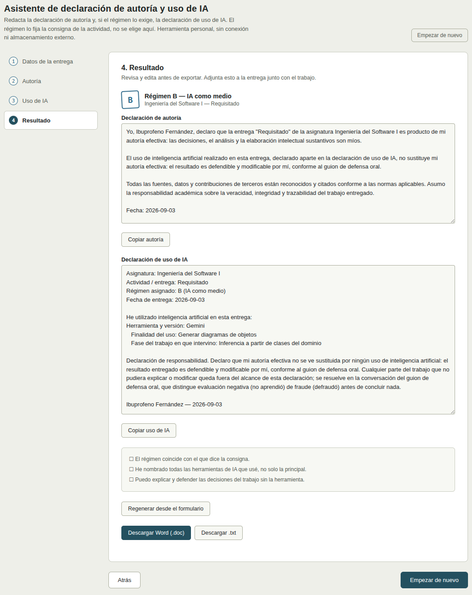

# ALUMNO - Asistente de declaración de autoría y uso de IA

Herramienta para que el alumnado redacte la declaración de autoría y, si el régimen lo exige, la declaración de uso de IA de una entrega.

**[Abrir el asistente](https://mmasias.github.io/pyAI-edu/tools/asistente-declaracion-alumno.html)** — se abre en el navegador, no necesita instalar nada y funciona sin conexión una vez cargado. Nada de lo que escribas se guarda ni se envía a ningún sitio: al cerrar la pestaña se pierde lo que no hayas descargado.

Lo habitual es llegar aquí desde el **enlace que el profesorado incluye en la consigna**: en ese caso, el régimen, la asignatura y la actividad ya vienen puestos. El régimen no se elige en el asistente; lo fija la consigna.

## Cómo funciona, paso a paso

<div align="center" markdown="1">



_**1. Datos de la entrega.** Asignatura, actividad, docente y modalidad (individual o grupal). El régimen se recoge tal como lo indica la consigna; si abriste el asistente desde el enlace de la consigna, ya viene marcado._



_**2. Autoría.** Nombre y apellidos. En modalidad grupal, cada integrante y su contribución. Esta declaración es obligatoria en todos los regímenes, también en A._



_**3. Uso de IA.** No aparece si el régimen es A. En B y D: si se usó IA y, por cada herramienta, cuál y con qué versión, para qué y en qué fase del trabajo. No hay que reconstruir la conversación ni pegar registros._



_**4. Resultado.** Se generan las declaraciones, editables, con una lista de comprobación antes de entregar. Descarga en Word o texto, o copia al portapapeles. Se adjunta a la entrega junto con el trabajo._

</div>

## Qué genera el asistente

<div align="center" markdown="1">

| Declaración de autoría | Declaración de uso de IA |
|---|---|
| Obligatoria en todos los regímenes. Afirma que el trabajo es de autoría efectiva del alumno o del grupo y que las fuentes están reconocidas y citadas. En régimen A añade que no se ha usado IA; en B y D, que el uso de IA no sustituye la autoría. | Solo en regímenes B y D. Deja constancia de qué herramientas de IA se usaron, para qué y en qué fase. No reconstruye la conversación: es una constancia mínima, no un registro exhaustivo. |

</div>

A continuación, un ejemplo completo (régimen B, entrega individual).

### Declaración de autoría

```
Yo, [nombre y apellidos], declaro que la entrega "Requisitado" de la asignatura Ingeniería del Software I es producto de mi autoría efectiva: las decisiones, el análisis y la elaboración intelectual sustantivos son míos.

El uso de inteligencia artificial realizado en esta entrega, declarado aparte en la declaración de uso de IA, no sustituye mi autoría efectiva: el resultado es defendible y modificable por mí, conforme al guion de defensa oral.

Todas las fuentes, datos y contribuciones de terceros están reconocidos y citados conforme a las normas aplicables. Asumo la responsabilidad académica sobre la veracidad, integridad y trazabilidad del trabajo entregado.

Fecha: 2026-09-03
```

### Declaración de uso de IA

```
Asignatura: Ingeniería del Software I
Actividad / entrega: Requisitado
Régimen asignado: B (IA como medio)
Fecha de entrega: 2026-09-03

He utilizado inteligencia artificial en esta entrega:
Herramienta y versión: Gemini
   Finalidad del uso: Generar diagramas de objetos
   Fase del trabajo en que intervino: Inferencia a partir de clases del dominio

Declaración de responsabilidad. Declaro que mi autoría efectiva no se ve sustituida por ningún uso de inteligencia artificial: el resultado entregado es defendible y modificable por mí, conforme al guion de defensa oral. Cualquier parte del trabajo que no pudiera explicar o modificar queda fuera del alcance de esta declaración; se resuelve en la conversación del guion de defensa oral, que distingue evaluación negativa (no aprendió) de fraude (defraudó) antes de concluir nada.

[nombre y apellidos] — 2026-09-03
```
